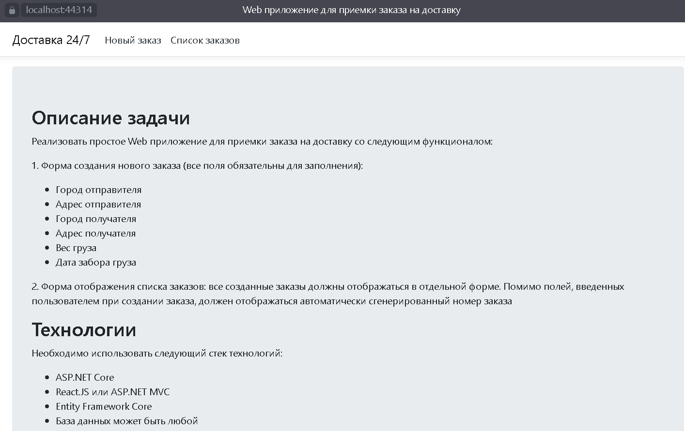
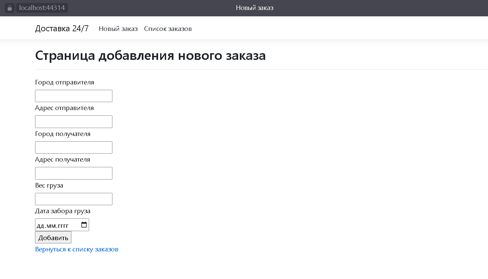
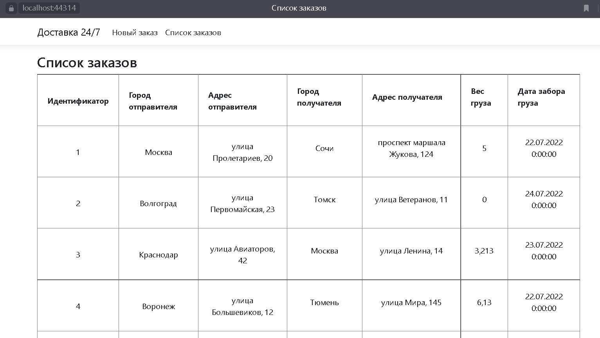

<h1 align="center">WebAppVersta24</h1>
<h3 align="center">Тестовое задание: написать простое веб-приложение для приемки заказов на доставку</h3>

  

## Главная форма

## Форма добавления нового заказа

## Форма просмотра списка заказов

## Описание

### :white_check_mark: Используемые технологии:

- ASP.NET Core MVC
- Entity Framework Core
- БД SQL Server
- Visual Studio v2019

### Кратко о том, как запустить проект:

1. Склонировать проект на свой ПК или скачать zip-файл и распокавать его.
2. Открыть скачанный проект с помощью Visual Studio.
3. Запустить проект на локальном хостинге в Visual Studio.

Все просто, но ~~*__танцы с бубном никто не отменял__*~~

